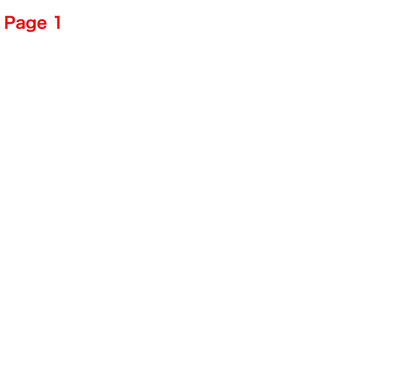
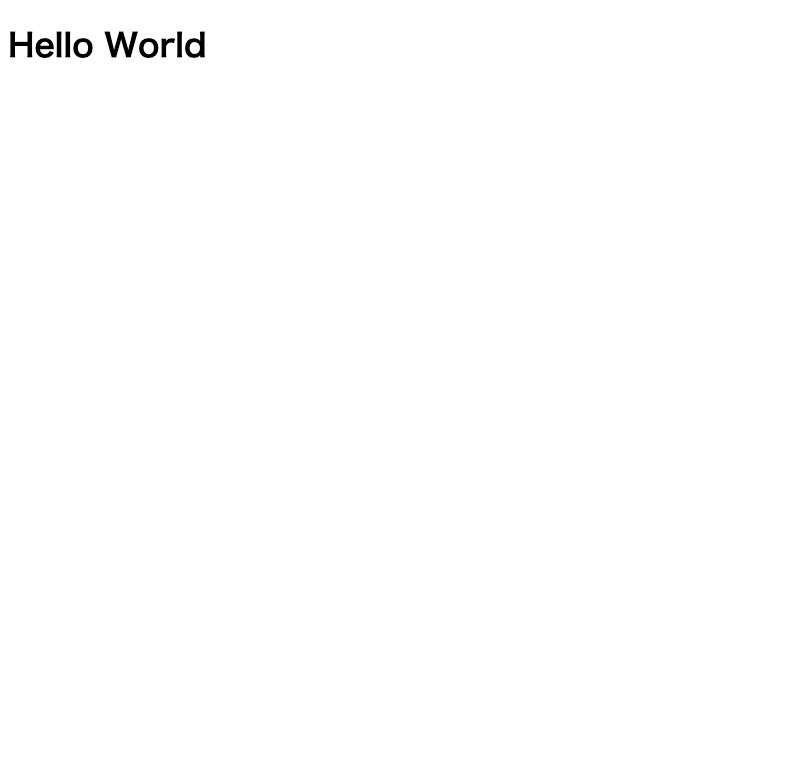
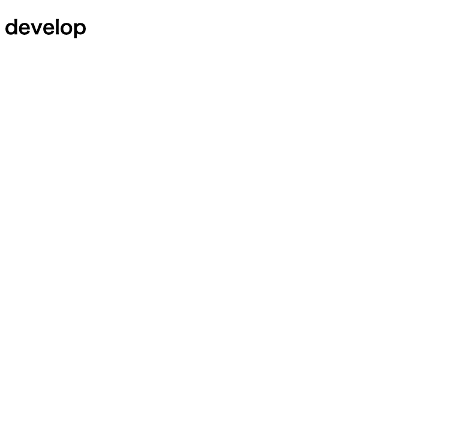
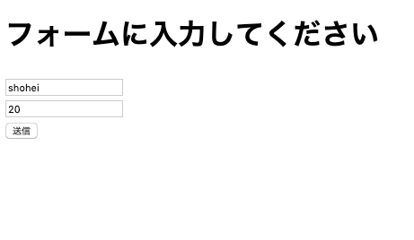
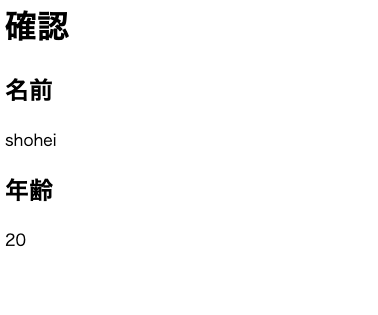
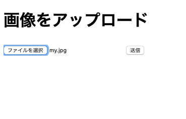
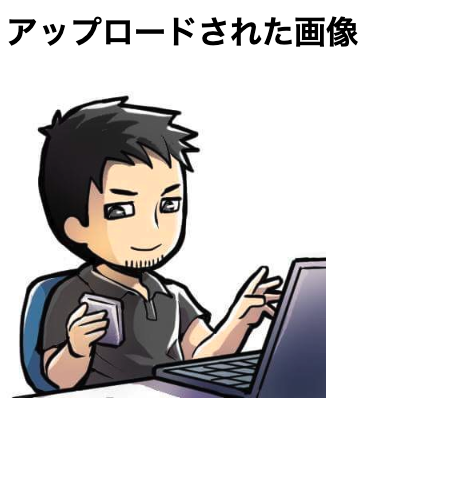
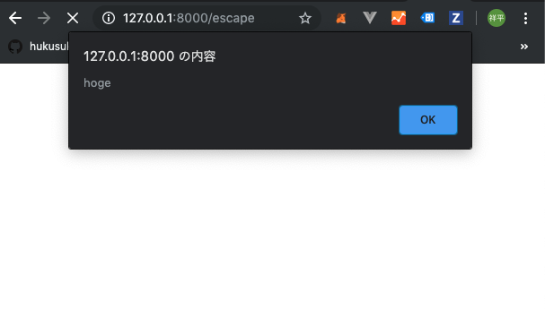
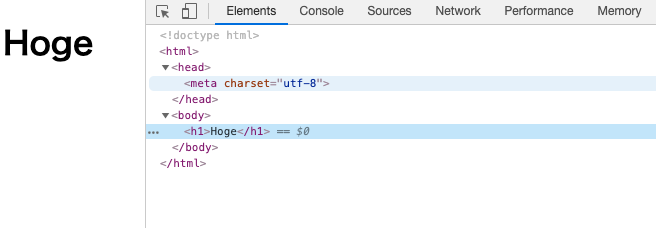
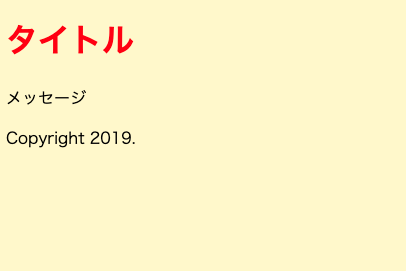

# Django-Training

> Django + PostgreSQLでWeb開発

## 目次
- [環境構築](#環境構築)
- [Hello Worldを表示](#トレーニング)
- [ルーティング](#ルーティング)
- [リクエストメソッド](#リクエストメソッド)
- [静的ファイルの利用](#静的ファイルの利用)
- [HTMLのレンダリング](HTMLのレンダリング)
- [リクエストを受け取る](#リクエストを受け取る)
- [DTLの利用](#DTLの利用)
- Bootstrapの利用
- PostgreSQLの利用


## 開発環境
- Python 3.6
- Django 2.2.3

## 環境構築

djangoをインストールします。

```cmd
$ pip3 install django

$ django-admin --version
2.2.3
```

次に仮想環境へDjangoを導入します。

仮想環境は venv を用います。venv は軽量な仮想環境作成をサポートするツールです。

仮想環境用のディレクトリを作成し、仮想環境を作成します。

```cmd
$ mkdir djangoLesson
$ python3 -m venv djangoLesson
```

仮想環境が作成できたら、仮想環境を有効にするため bin/activate を実行します。

```cmd
$ cd djangoLesson
$ source bin/activate
```

仮想環境を有効化できたので、この状態でdjangoをインストールします。

```cmd
$ pip3 install django
```

以後、仮想環境からdjangoを利用する場合はあらかじめ bin/activate で仮想環境を有効化する必要があります。


次にWebアプリのプロジェクトを作成します。

```cmd
$ django-admin startproject djangoLesson
```

djangoLessonのディレクトリが生成されます。

```cmd
djangoLesson/
├── djangoLesson
│   ├── __init__.py
│   ├── settings.py
│   ├── urls.py
│   └── wsgi.py
└── manage.py
```

|ファイル|説明|
|---|---|
|settings.py|アプリ全般の設定ファイルです。|
|urls.py|URLのルーティング設定を行うファイルです。|
|wsgi.py|アプリをデプロイするために必要なファイルです。|
|manage.py|アプリを起動するためのファイルです。開発者がこのファイルを編集することはありません。|


ローカルサーバーで起動します。 

```cmd
# manage.py があるディレクトリに移動する
$ cd djangoLesson

# ローカルサーバーを起動
$ python3 manage.py runserver
```

起動が成功すると、次のようなログがターミナル上に表示されます。

```cmd
Watching for file changes with StatReloader
Performing system checks...

System check identified no issues (0 silenced).

You have 17 unapplied migration(s). Your project may not work properly until you apply the migrations for app(s): admin, auth, contenttypes, sessions.
Run 'python manage.py migrate' to apply them.

August 16, 2019 - 23:21:27
Django version 2.2.4, using settings 'djangoLesson.settings'
Starting development server at http://127.0.0.1:8000/
Quit the server with CONTROL-C.
```

ブラウザで http://127.0.0.1:8000/ を開くと、次の画面が表示されます。


環境構築はこれで完了です。

## トレーニング
Djangoフレームワークを学びます。サンプルコードを写経し実行した後、課題を進めてください。

### Hello Worldを表示

DjangoでHello Worldを表示させましょう。

djangoLesson/views.py を作成して、次のコードを実装します。

```python
from django.http import HttpResponse

def index(request):
  return HttpResponse("Hello World")
```

djangoLesson/urls.pyに次のコードを実装します。

```python
from django.contrib import admin
from django.urls import path

from . import views # 追加

urlpatterns = [
    path('', views.index), # 追加
    path('admin/', admin.site.urls),
]
```

urls.py では パス とルーティングで表示させたい view とを紐づけます。

この場合 http://127.0.0.1:8000/ と views.py で実装した index関数 が紐づきます。

index関数では HttpResponse を使って Hello World の文字列を返しているだけなので、アクセスすると画面上に Hello World が表示されます。

ブラウザで http://127.0.0.1:8000/ を開くと次の画面が表示されます。


### ルーティング

ページを追加する場合は、ルーティングの設定を行います。

djangoLesson/urls.py に追加したいページの パス を path() を使用して追加します。

2つのページを追加してみます。

djangoLesson/views.py に次の関数を追加します。

```python
def hoge(request):
  return HttpResponse("hoge")

def fuga(request):
  return HttpResponse("fuga")
```

djangoLesson/urls.py に hoge と fuga をルーティングへ追加します。

```python
urlpatterns = [
    path('', views.index),
    path('hoge/', views.hoge), # 追加
    path('fuga/', views.fuga), # 追加
    path('admin/', admin.site.urls),
]
```

ブラウザで http://127.0.0.1:8000/hoge/ と http://127.0.0.1:8000/fuga/ にアクセスするとページが表示されます。

##### パスごとに設定ファイルを分ける

特定のパスに対応する処理を追加することができます。「アプリケーションを追加する」と呼んでいます。

例えば http://127.0.0.1:8000/dapp/ というURLに対する処理を一括で追加することができます。

次のコマンドを入力して dapp アプリケーションを追加します。

```cmd
python3 manage.py startapp dapp
```

すると djangoLesson の同層に dapp　ディレクトリが追加されます。この中にDjangoアプリの雛形が入っています。

では、作成した dapp を動かせれるよう設定します。

dapp/views.py を次のように実装します。

```python
from django.shortcuts import render
from django.http import HttpResponse

def index(request):
  return HttpResponse("dapp index")

def foo(request):
  return HttpResponse("dapp foo")
```

dapp/urls.py を作成して、次のように実装します。

```python
from django.urls import path

from . import views

urlpatterns = [
    path('', views.index),
    path('foo', views.foo),
]
```

次に、djangoLesson から dapp を参照できるようにします。

djangoLesson/urls.py に dapp を追加します。

```python
from django.contrib import admin
from django.urls import path, include # include追加

from . import views

urlpatterns = [
    path('', views.index),
    path('dapp/', include('dapp.urls')), # 追加
    path('hoge/', views.hoge),
    path('fuga/', views.fuga),
    path('admin/', admin.site.urls),
]
```
http://127.0.0.1:8000/dapp/ や　http://127.0.0.1:8000/dapp/foo にアクセスできるようになります。


#### 課題

views.py に djangoDayo関数 実装して Django Dayo の文字列だけを表示するページを作成してください。

ブラウザで http://127.0.0.1:8000/djangoDayo/ を開いて確認できること。


### リクエストメソッド

HTTPでは同じパスに対して異なるメソッドを提供することができます。リクエストメソッドと呼ばれ、データのCRUD（作成、取得、更新、削除）操作に応じて処理を扱えることができます。

| メソッド | 用途 |
|:---|:---|
|GET | データの取得 |
|POST | データの作成 |
|PUT | データの更新 |
|DELETE | データの削除 |

requeset.method で送られてきたリクエストメソッドを判断できます。

djangoLesson/views.py に次のコードを追加します。

```python
from django.views.decorators.csrf import csrf_exempt # 追加

# 追加
@csrf_exempt
def crud(request):
  if request.method == 'POST':
    return HttpResponse('POST')
  elif request.method == 'GET':
    return HttpResponse('GET')
  elif request.method == 'PUT':
    return HttpResponse('PUT')
  elif request.method == 'DELETE':
    return HttpResponse('DELETE')
  else:
    return HttpResponse('Unknown')
```

djangoLesson/urls.py に crud のパスを追加します。

```python
urlpatterns = [
    path('', views.index),
    path('dapp/', include('dapp.urls')),
    path('hoge/', views.hoge),
    path('fuga/', views.fuga),
    path('crud/', views.crud),  # 追加
    path('admin/', admin.site.urls),
]
```

リクエストメソッド毎に実装通りの結果が返ってくるか確認します。

curl コマンドを用いて http://127.0.0.1:8000/crud/ へリクエストを送ります。

```cmd
$ curl http://127.0.0.1:8000/crud/
GET

$ curl -X GET http://127.0.0.1:8000/crud/
GET

$ curl -X POST http://127.0.0.1:8000/crud/
POST

$ curl -X DELETE http://127.0.0.1:8000/crud/
DELETE

$ curl -X PUT http://127.0.0.1:8000/crud/
PUT

$ curl -X A http://127.0.0.1:8000/crud/
Unknown
```

### 静的ファイルの利用

Webアプリケーションで画像・動画ファイル、JavaScript、CSS（スタイルシート）を配信できるようにしていきます。

djangoLesson/setting.py で基本設定を見ていきます。

django.contrib.staticfiles が設定されていることを確認してください。

```python
INSTALLED_APPS = [
    'django.contrib.admin',
    'django.contrib.auth',
    'django.contrib.contenttypes',
    'django.contrib.sessions',
    'django.contrib.messages',
    'django.contrib.staticfiles',
]
```

STATIC_URL にディレクトリのパスが設定されていることを確認してください。

```python
STATIC_URL = '/static/'
```

配信するファイルを格納するディレクトリの絶対パスを設定します。

djangoLesson/setting.py の最後に次のコードを追加してください。

```python
STATICFILES_DIRS = [
    os.path.join(BASE_DIR, 'static'),
]
```

CSSを配信できるか確認します。

static ディレクトリを作成して次のCSSファイルを作成してください。

```cmd
$ mkdir static | touch ./static/style.css
$ ls
dapp            db.sqlite3      djangoLesson    manage.py       static
```

static/style.css に次のコードを追加してください。

```css
h1 {
  color: red;
}
```

djangoLesson/views.py に次のコードを追加します。

```python
def page1(request):
  return HttpResponse("""
    <!DOCTYPE html>
    <html>
      <head>
        <meta charset="utf-8" />
        <link rel="stylesheet" href="/static/style.css" />
      </head>
      <body>
        <h1>Page 1</h1>
      </body>
    </html>
  """)
```

djangoLesson/urls.py に page1 のパスを追加します。

```python
urlpatterns = [
    path('', views.index),
    path('dapp/', include('dapp.urls')),
    path('hoge/', views.hoge),
    path('fuga/', views.fuga),
    path('crud/', views.crud),
    path('page1/', views.page1),  # 追加
    path('admin/', admin.site.urls),
]
```

http://127.0.0.1:8000/page1/ を開くと次の画面が表示されます。

style.cssが反映されていることを確認できます。



### HTMLのレンダリング

DjangoではDTL（Django template language）と呼ばれれるテンプレートエンジンを使ってHTMLを扱います。

DTLでは、HTMLで変数を使用する際は **{{}}** で変数を囲って使用します。

テンプレートはHTMLファイルに対してユーザーからの入力値などの要素を表示できるようにしたものです。

実際にユーザーがサーバーへリクエストを行い、その結果を表示できるようにしたものです。

djangoLesson/setting.py でテンプレートエンジンの設定を行います。DIRSに os.path.join(BASE_DIR, 'templates') を追加します。

```python
TEMPLATES = [
    {
        'BACKEND': 'django.template.backends.django.DjangoTemplates',
        'DIRS': [
          os.path.join(BASE_DIR, 'templates') # 追加
        ],
        'APP_DIRS': True,
        'OPTIONS': {
            'context_processors': [
                'django.template.context_processors.debug',
                'django.template.context_processors.request',
                'django.contrib.auth.context_processors.auth',
                'django.contrib.messages.context_processors.messages',
            ],
        },
    },
]
```

次に、templates ディレクトリを作成し、その中にindex.htmlを作成します。

```cmd
$ mkdir templates | touch ./templates/index.html
$ ls
dapp            db.sqlite3      djangoLesson    manage.py       static          templates
```

templates/index.html を次の通りに実装します。

```html
<!DOCTYPE HTML>
<html>
  <head>
    <meta charset="utf-8" />
  </head>
  <body>
    <h1>{{ title }}</h1>
  </body>
</html>
```

djangoLesson/views.py に次のコードを実装します。

```python
from django.http import HttpResponse
from django.views.decorators.csrf import csrf_exempt
from django.shortcuts import render # 追加

# 変更
def index(request):
  return render(request, 'index.html', {'title': 'Hello World'})
```

http://127.0.0.1:8000/ にアクセスすると、views.py で指定した titleパラメータ が index.html に反映されていることを確認できます。



次に、ユーザーの入力値をページに反映してみます。

index.html と同じ内容をコピーして、puge.htmlを作成します。

djangoLesson/urls.py に path を追加します。

```python
[
    .......
    path('puge/<value>', views.puge), # 追加
    path('admin/', admin.site.urls),
]
```
djangoLesson/views.py に puge を追加します。

```python
def puge(request, value):
  return render(request, 'puge.html', {'title': value})
```

http://127.0.0.1:8000/puge/develop にアクセスすると、次の画面が表示されます。



#### 課題

次のコードが書かれた koge.html を作成して、http://127.0.0.1:8000/koge/aiueo にアクセスすると、aiueoが表示できるようにしてください。

```html
<!DOCTYPE HTML>
<html>
  <head>
    <meta charset="utf-8" />
  </head>
  <body>
    <p>{{ description }}</p>
  </body>
</html>
```


### リクエストを受け取る

#### GETリクエスト

ユーザーから送信されたリクエストを受け取る方法を確認します。

request からリクエストメソッドとパラメータを取得することができます。

request.GET.get('q') を用いて、リクエストパラメータを受け取るページを作成します。

djangoLesson/views.py に search を追加します。

```python
def search(request):
  q = request.GET.get('q')
  return HttpResponse(q)
```

djangoLesson/urls.py に path を追加します。

```python
urlpatterns = [
    path('', views.index),
    .....
    path('search', views.search), # 追加
    path('admin/', admin.site.urls),
]
```

http://127.0.0.1:8000/search?q=hoge にアクセスすると画面上にリクエストパラメータで指定した文字が表示されます。


#### POSTリクエスト

POSTリクエストでユーザーから送信されたフォームを受け取る方法を確認します。

まずは、フォームを作成します。templates/post_form.html を作成して、次の通りに実装します。

```html
<!DOCTYPE HTML>
<html>
  <head>
    <meta charset="utf-8" />
  </head>
  <body>
    <h1>フォームに入力してください</h1>
    <form method="POST" action="/postSend">
      
      <div>
        <input placeholder="名前" name="name" type="text"/>
      </div>
      <div>
        <input placeholder="年齢" name="age" type="number"/>
      </div>
      <input value="送信" type="submit" />
    </form>
  </body>
</html>
```

送られてきたフォームの入力データを表示するページを作成します。templates/post_display.html を作成して、次の通りに実装します。

```html
<!DOCTYPE HTML>
<html>
  <head>
    <meta charset="utf-8" />
  </head>
  <body>
    <h1>確認</h1>
    <h2>名前</h2>
    <p>{{ name }}</p>
    <h2>年齢</h2>
    <p>{{ age }}</p>
  </body>
</html>
```

不正なリクエストが送られてきた時に表示するページを作成します。 templates/error.html を作成して、次の通りに実装します。

```html
<!DOCTYPE HTML>
<html>
  <head>
    <meta charset="utf-8" />
  </head>
  <body>
    <h1>不正なリクエストです。</h1>
  </body>
</html>
```

djangoLesson/views.py に post_form と postSendを追加します。

postSendでは送られてきたデータを確認して、post_display.html へデータを渡してレンダリングします。不正なデータであれば error.html をレンダリングします。

```python
def post_form(requset):
  return render(requset, 'post_form.html')

def postSend(request):
  if request.POST['name'] and request.POST['age']:
    return render(request, 'post_display.html', {'name': request.POST['name'], 'age': request.POST['age']})
  else:
    return render(request, 'error.html')
```

djangoLesson/urls.py に path を追加します。

```python
urlpatterns = [
    path('', views.index),
    .....
    path('post_form', views.post_form), # 追加
    path('postSend', views.postSend),   # 追加
    path('admin/', admin.site.urls),
]
```

http://127.0.0.1:8000/post_form にアクセスしてフォームに入力後、送信ボタンを押すと 確認画面に遷移されます。



<br>


また、フォームに何も入力していない状態で送信ボタンを押すと、不正なリクエストと判断されてエラー画面が表示されます。

#### バイナリデータを扱う

画像などのバイナリデータをアップロードして取得する方法を確認します。

まずは、フォームを作成します。templates/post_form_image.html を作成して、次の通りに実装します。

```html
<!doctype html>
<html>
  <head>
    <meta charset="utf-8"/>
  </head>
  <body>
    <h1>画像をアップロード</h1>
    <form method="POST" action="/imageUpload" enctype="multipart/form-data">
      
      <input name="image" type="file"/>
      <input value="送信" type="submit"/>
    </form>
  </body>
</html>
```

次に、アップロードされたファイルを閲覧するためのページを作成します。templates/post_display_image.html を作成して、次の通りに実装します。

```html
<!doctype html>
<html>
  <head>
    <meta charset="utf-8"/>
  </head>
  <body>
    <h1>アップロードされた画像</h1>
    
  </body>
</html>
```

djangoLesson/views.py に post_form_image と imageUpload を追加します。

imageUpload にはリクエストで送られてきた画像データをコピーして static ディレクトリの中に保存します。

保存した画像データのパスを post_display_image.html へ渡してレンダリングします。

```python
from django.http import HttpResponse, HttpResponseRedirect # 追加
from django.views.decorators.csrf import csrf_exempt
from django.shortcuts import render

from hashlib import md5 # 追加

....

# 追加
def post_form_image(request):
  return render(request, 'post_form_image.html')

def imageUpload(request):
  if request.method == 'POST' and request.FILES['image'] and (request.FILES['image'].content_type == "image/png" or request.FILES['image'].content_type == "image/jpeg"):
    # 画像の拡張子
    extension = ".jpg"
    if request.FILES['image'].content_type == "image/png":
      extension = ".png"

    # ファイル名
    filename = md5(request.FILES['image'].name.encode('utf-8')).hexdigest() + extension

    # ファイルパス
    filepath = 'static/' + filename

    # 画像データを image へ書き写す
    image = open(filepath, 'wb')
    for chunk in request.FILES['image'].chunks():
      image.write(chunk)
    return render(request, 'post_display_image.html', {'filepath': filepath})
  else:
    return HttpResponseRedirect('/post_form_image')
```

djangoLesson/urls.py に path を追加します。

```python
urlpatterns = [
    path('', views.index),
    .....
    path('post_form_image', views.post_form_image), # 追加
    path('imageUpload', views.imageUpload), # 追加
    path('admin/', admin.site.urls),
]
```

http://127.0.0.1:8000/post_form_image にアクセスして画像ファイルを送信すると確認画面へ遷移できます。




<br>



static ディレクトリには、英数字の名前に書き換わった画像ファイルが保存されます。


#### 課題

次のプロフィール内容を送信できるフォームを作成し、その内容をを確認できる画面を作成してください。

- 名前
- 年齢
- 自己紹介


### DTLの利用

#### 辞書型データ

ネストされた辞書型データにアクセスできます。

djangoLesson/views.py

```python
def dic(request):
  return render(request, 'dic.html', {'obj': {'title': 'hoge'}}) # 辞書型
```

templates/dic.html

```html
<!DOCTYPE HTML>
<html>
  <head>
    <meta charset="utf-8" />
  </head>
  <body>
    <!-- 辞書型で渡されたデータを表示 -->
    <h1>{{ obj.title }}</h1>
  </body>
</html>
```

djangoLesson/urls.py

```python
urlpatterns = [
    path('', views.index),
    ...
    path('dic', views.dic), # 追加
    path('admin/', admin.site.urls),
]
```

#### エスケープ

XSS脆弱性対策のため、DTLではディフォルトではエスケープが有効かされています。

これを無効化することも可能です。

```

 {{ hoge }}

```

templates/escape.html

```html
<!DOCTYPE HTML>
<html>
  <head>
    <meta charset="utf-8" />
  </head>
  <body>
    
      <p>{{ unescaped }}</p>
    
  </body>
</html>
```

djangoLesson/views.py

```python
def escape(request):
  return render(request, 'escape.html', {'unescaped': '<script>alert(\'hoge\')</script>'})
```

djangoLesson/urls.py

```python
urlpatterns = [
    path('', views.index),
    ...
    path('escape', views.escape), # 追加
    path('admin/', admin.site.urls),
]
```

http://127.0.0.1:8000/escape にアクセスすると、アラートが表示されます。





#### 条件分岐

if文を使用することができます。構文はPythonと同じです。

random の値によって表示する内容を変更するページを作成します。

templates/sample_if.html

```html
<!DOCTYPE HTML>
<html>
  <head>
    <meta charset="utf-8" />
  </head>
  <body>
    
      <h1>Hoge</h1>
    
      <h1>Foo</h1>
    
      <h1>Fuga</h1>
    
  </body>
</html>
```

djangoLesson/views.py

```python
from random import random # 追加

...

def sample_if(request):
  return render(request, 'sample_if.html', {'random': random()})
```


djangoLesson/urls.py

```python
urlpatterns = [
    path('', views.index),
    ...
    path('sample_if', views.sample_if), # 追加
    path('admin/', admin.site.urls),
]
```

http://127.0.0.1:8000/sample_if にアクセスするたびに、ランダムで Hoge, Foo, Fugeのどちからが表示されます。

#### 繰り返し（ループ）

for文を使用することができます。構文はPythonと同じです。

templates/sample_for.html

```html
<!DOCTYPE HTML>
<html>
  <head>
    <meta charset="utf-8" />
  </head>
  <body>
    <ul>
    
      <li>{{ item }}</li>
    
    </ul>
  </body>
</html>
```

djangoLesson/views.py

```python
def sample_for(request):
  return render(request, 'sample_for.html', {'list': ['Hoge', 'Fuga', 'Foo']})
```

djangoLesson/urls.py

```python
urlpatterns = [
    path('', views.index),
    ...
    path('sample_for', views.sample_for), # 追加
    path('admin/', admin.site.urls),
]
```

http://127.0.0.1:8000/sample_for にアクセスすると、配列で渡したデータが列挙されます。

#### コメント

コメントは **{# #}** を使用します。DTLでのコメントはHTMLの出力時に自動的に取り除かるため、ページにアクセスしたユーザーに見られることはありません。

templates/sample_comment.html

```html
<!DOCTYPE HTML>
<html>
  <head>
    <meta charset="utf-8" />
  </head>
  <body>
    {# My comment. #}
    <h1>Hoge</h1>
  </body>
</html>
```

djangoLesson/views.py

```python
def sample_comment(request):
  return render(request, 'sample_comment.html')
```

djangoLesson/urls.py

```python
urlpatterns = [
    path('', views.index),
    ...
    path('sample_comment', views.sample_comment), # 追加
    path('admin/', admin.site.urls),
]
```

http://127.0.0.1:8000/sample_comment にアクセスして表示されているHTMLを確認すると、コメント部分が無いことを確認できます。





#### テンプレートの継承

テンプレートを継承することで、共通のデザインを使い回すことができます。

子テンプレートからコンテンツを追加できるようにするためには  を用います。継承先のテンプレートにあらかじめ初期値を入れておくと使いやすくなります。

共通のデザインとなるテンプレートを作成します。

templates/sample_theme.html

```html
<!doctype html>
<html>
  <head>
    
    <link rel="stylesheet" href="/static/style.css" />
    <title></title>
    
  </head>
  <body>
    <div id="content">
      
      
    </div>
    <div id="footer">
      
        Copyright 2019.
      
    </div>
  </body>
</html>
```

それを子テンプレートから呼び出します。継承する際は  を用いて継承したいページを指定します。

templates/sample_index.html

```html

Hello World

  {{ block.super }}
  <style type="text/css">
    body {
      background-color: #fffacd;
    }
  </style>


    <h1>{{ title }}</h1>
    <p>
      {{ message }}
    </p>

```

djangoLesson/views.py

```python
def sample_index(request):
  return render(request, 'sample_index.html')
```

djangoLesson/urls.py

```python
urlpatterns = [
    path('', views.index),
    ...
    path('sample_index', views.sample_index), # 追加
    path('admin/', admin.site.urls),
]
```

http://127.0.0.1:8000/sample_index にアクセスすると次の画面が表示されます。




## 参考文献

[Python3 + Django2.0入門 - Pythonで作るWebアプリケーション開発入門 - その１](https://www.amazon.co.jp/gp/product/B07GNJW2QN)

[Python3 + Django2.0入門 - Pythonで作るWebアプリケーション開発入門 - その２](https://www.amazon.co.jp/gp/product/B07GNPK25J)


