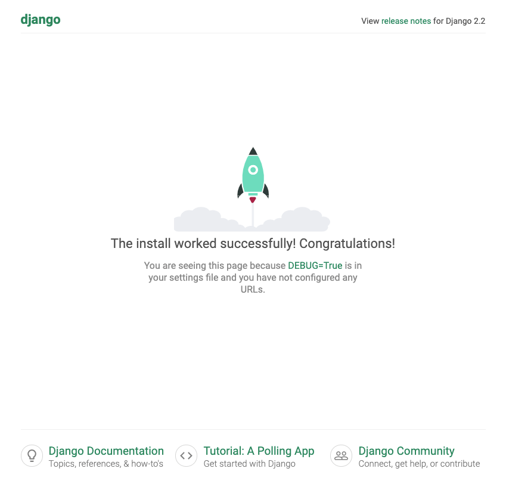

# Django-Training

> Django + MySQLでWeb開発

## 目次
- [環境構築](#環境構築)
- [Hello Worldを表示](#トレーニング)


## 開発環境
- Python 3.6
- Django 2.2.3

## 環境構築

djangoをインストールします。

```cmd
$ pip3 install django

$ django-admin --version
2.2.3
```

次に仮想環境へDjangoを導入します。

仮想環境は venv を用います。venv は軽量な仮想環境作成をサポートするツールです。

仮想環境用のディレクトリを作成し、仮想環境を作成します。

```cmd
$ mkdir djangoLesson
$ python3 -m venv djangoLesson
```

仮想環境が作成できたら、仮想環境を有効にするため bin/activate を実行します。

```cmd
$ cd djangoLesson
$ source bin/activate
```

仮想環境を有効化できたので、この状態でdjangoをインストールします。

```cmd
$ pip3 install django
```

以後、仮想環境からdjangoを利用する場合はあらかじめ bin/activate で仮想環境を有効化する必要があります。


次にWebアプリのプロジェクトを作成します。

```cmd
$ django-admin startproject djangoLesson
```

djangoLessonのディレクトリが生成されます。

```cmd
djangoLesson/
├── djangoLesson
│   ├── __init__.py
│   ├── settings.py
│   ├── urls.py
│   └── wsgi.py
└── manage.py
```

|ファイル|説明|
|---|---|
|settings.py|アプリ全般の設定ファイルです。|
|urls.py|URLのルーティング設定を行うファイルです。|
|wsgi.py|アプリをデプロイするために必要なファイルです。|
|manage.py|アプリを起動するためのファイルです。開発者がこのファイルを編集することはありません。|


ローカルサーバーで起動します。 

```cmd
# manage.py があるディレクトリに移動する
$ cd djangoLesson

# ローカルサーバーを起動
$ python3 manage.py runserver
```

起動が成功すると、次のようなログがターミナル上に表示されます。

```cmd
Watching for file changes with StatReloader
Performing system checks...

System check identified no issues (0 silenced).

You have 17 unapplied migration(s). Your project may not work properly until you apply the migrations for app(s): admin, auth, contenttypes, sessions.
Run 'python manage.py migrate' to apply them.

August 16, 2019 - 23:21:27
Django version 2.2.4, using settings 'djangoLesson.settings'
Starting development server at http://127.0.0.1:8000/
Quit the server with CONTROL-C.
```

ブラウザで http://127.0.0.1:8000/ を開くと、次の画面が表示されます。



環境構築はこれで完了です。

## トレーニング
Djangoフレームワークを学びます。サンプルコードを写経し実行した後、課題を進めてください。

### Hello Worldを表示

DjangoでHello Worldを表示させましょう。

djangoLesson/views.py を作成して、次のコードを実装します。

```python
from django.http import HttpResponse

def helloWorld(request):
  return HttpResponse("Hello World")
```

djangoLesson/urls.pyに次のコードを実装します。

```python
from django.contrib import admin
from django.urls import path

from . import views # 追加

urlpatterns = [
    path('helloWorld/', views.helloWorld), # 追加
    path('admin/', admin.site.urls),
]
```

urls.pyではURLとルーティングで表示させたいページとを紐づけます。

この場合 http://127.0.0.1:8000/helloWorld/ と views.py で実装した helloWorld関数 が紐づきます。

helloWorld関数では HttpResponse を使って Hello World の文字列を返しているだけなので、URLへアクセスすると画面上に Hello World が表示されます。

ブラウザで http://127.0.0.1:8000/helloWorld/ を開くと次の画面が表示されます。


#### 課題 1

views.py に djangoDayo関数 実装して Django Dayo の文字列だけを表示するページを作成してください。

ブラウザで http://127.0.0.1:8000/djangoDayo/ を開いて確認できること。


## 参考文献

・Python3 + Django2.0入門 - Pythonで作るWebアプリケーション開発入門 - その１<br>
[https://www.amazon.co.jp/gp/product/B07GNJW2QN?ref_=dbs_pwh_calw_0&storeType=ebooks](https://www.amazon.co.jp/gp/product/B07GNJW2QN?ref_=dbs_pwh_calw_0&storeType=ebooks)


・Python3 + Django2.0入門 - Pythonで作るWebアプリケーション開発入門 - その２<br>
[https://www.amazon.co.jp/gp/product/B07GNPK25J?ref_=dbs_pwh_calw_1&storeType=ebooks](https://www.amazon.co.jp/gp/product/B07GNPK25J?ref_=dbs_pwh_calw_1&storeType=ebooks)